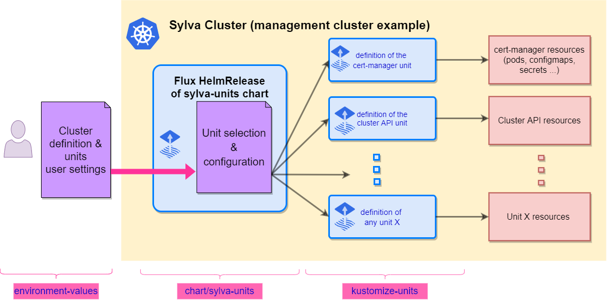

# sylva-core

This project provides the tools and configurations to set up a Sylva management cluster in a declarative way. It relies on [Cluster API](https://cluster-api.sigs.k8s.io/) to manage cluster lifecycle, and uses [Flux](https://fluxcd.io/flux/) to keep clusters and infrastructure components in sync with their definitions in Git.

This project is delivering the sylva-units helm chart that creates Flux objects used to deploy various software components, called "units". Each of these unit definition will be derived into a set of flux resources (Gitrepositories, Kustomizations, HelmReleases...) following the specific settings defined for the deployment.

Helm has indeed several features that can be advantageously leveraged to fullfill our goals:

- The templating enables us to ease the configuration of flux objects with a very limited boilerplate
- Thanks to an internal templating of values, we can share user provided values among several units, and add some extra logic in their configuration
- As several layers of user values can be merged on top of default ones, it provides a convenient way to adapt this upstream chart to various deployment contexts
- Its internal schema validation allows to control user values prior to interpret them
- And finally as it centralizes the versions of all units, it can be used to tag releases of the Sylva stack.

In following readme, we assume that the reader is familiar with [cluster-api](https://cluster-api.sigs.k8s.io/) technology, as well as [flux](https://fluxcd.io/flux/) gitops tool (that is in turn heavily relying on [kustomize](https://kubectl.docs.kubernetes.io/references/kustomize/) and [helm](https://helm.sh/docs/))



## Repository structure

- [kustomize-units](kustomize-units) contains the manifests used to deploy various cluster-api & infrastructure units, they will be deployed as flux Kustomizations, and must contain some `kustomization.yaml` for that purpose. Note that such units could also live in external Git repositories.
- [charts/sylva-units](charts/sylva-units/README.md) is the main helm chart that controls the installation of selected/relevant flux Kustomizations in the cluster, as well as HelmReleases, depending on the context (bootstrap, management, workload cluster) and the type of cluster-api infrastructure/bootstrap providers that are used.
- [environment-values](environment-values) contains user-provided values to control the deployment of the cluster. They attempt to provide default parameters for various deployment scenarios, but may be modified to adapt  to deployment scenarios. They will be rendered locally using kustomize tool to generate values (and secrets for security-sensitive data) that will control the behavior of the helm chart.
- [tools](tools) contains some helper scripts for the bootstrap script, as well as some other utilities
- [bootstrap.sh](bootstrap.sh) scripts will bootstrap the management cluster using a temporary cluster as described below.
- [apply.sh](apply.sh) enables to install or update the units of the management cluster. It can be used on a pre-existing cluster installed manually, or on a cluster that has been bootstrapped with this project.

## How to deploy Sylva

### Requirements

- In order to be able to fetch Sylva and 3rd party artifacts, the Sylva clusters must have access to the internet (through an HTTP proxy if required), or to a registry that is mirroring all the required images and OCI artifacts.

### Defining your environment values

Management cluster configuration is done through the `sylva-units` chart values, as overrides over the chart [default values](./charts/sylva-units/values.yaml). In order to properly configure the cluster, it is important to understand how this configuration will be generated. The values are made up of two sections:

- The first one contains a list of sources and units that will be installed by Flux in the cluster. For example, following repo & unit definition will install the OpenStack infrastructure provider for cluster api (aka. capo) using a kustomization [./kustomize-units/capo](./kustomize-units/capo) hosted in the current repository.

```yaml
### Chart values ###
source_templates: # defines Flux GitRepository/OCIRepository resources
  [...]
  sylva-core:
    spec:
      url: https://gitlab.com/sylva-projects/sylva-core.git
      ref:
        branch: develop
units: # defines Flux Kustomizations & HelmReleases
  [...]
  capo:
    enabled: '{{ eq .Values.cluster.capi_providers.infra_provider "capo" }}'
    repo: sylva-core
    depends_on:
      cert-manager: true
    kustomization_spec:
      path: ./kustomize-units/capo
      wait: true
```

List of available units can be found into [`charts/sylva-units/units-description.md`](units-description.md).

- The second section contains "high level" values that are meant to be used in [goTpl expressions](https://helm.sh/docs/chart_template_guide/function_list/). For example, the capo controller unit defined above will occur if the user also provides following values to the chart (i.e.  `.Values.cluster.capi_providers.infra_provider` will be equal to `capo` ):

```yaml
### User values ###
cluster:
  capi_providers:
    infra_provider: capo
    bootstrap_provider: cabpk
  image: ...
```

As these values can be shared among multiple units, they'll allow us to define some global values, like `proxies`, that need to be configured at multiple places.

As user-provided parameters are merged over default chart values, we can also easily override anything in units definitions. For example, even if you choose kubeadm infra provider for your management cluster using `bootstrap_provider: cabpk`, as in the example above, you may also want to install rke2 infrastructure provider unit:

```yaml
### Chart values ###
units:
  [...]
  cabpr:  # RKE2
    enabled: '{{ .Values.cluster.capi_providers.bootstrap_provider | eq "cabpr" }}'
    repo: sylva-core
    depends_on:
      cert-manager: true
    kustomization_spec:
      path: ./kustomize-units/cabpr
      wait: true
```

This can be done by overwriting the chart value presented by forcing the `enabled` value of the unit:

```yaml
### User values ###
units:
  cabpr:
    enabled: yes
cluster:
  capi_providers:
    infra_provider: capo
    bootstrap_provider: cabpk
  image: ...
```

This mechanism is quite powerful, as it enables to adapt values to various contexts. In this project, we intend to maintain several configuration references that are provided as references in the [environment-values](environment-values) directory.

### Process to be followed for various infrastructure providers

<details><summary>
Deploying clusters in Docker using CAPD (click to expand)
</summary>

> **_NOTE:_** Deploying clustrers using this method will not work for the `btrfs` Docker storage driver until the [#8317](https://github.com/kubernetes-sigs/cluster-api/issues/8317) CAPD issue is fixed.

Even if it is not representative of any real-life deployment use-case, running clusters in Docker is useful to enable the testing of lifecycle management of clusters without any infrastructure requirement.

It can be used to test that stack on a laptop or in [GitLab-ci](.gitlab-ci.yml). You just have to
[install Docker](https://docs.docker.com/engine/install/) as a prerequisite, and then clone this
[project](https://gitlab.com/sylva-projects/sylva-core). The recommended Docker version is 23.0.6 which is proven
to work by [GitLab-ci](.gitlab-ci.yml). There is a known issue described in [issue #273](https://gitlab.com/sylva-projects/sylva-core/-/issues/273) when
using Docker 24.0.0 and [issue #368](https://gitlab.com/sylva-projects/sylva-core/-/issues/368) when using Docker between 19.03.1 to 19.03.4.

> **_NOTICE:_** When deploying on SUSE OS, please check whether DNS server is installed and enabled, see [SUSE Domain Name System](https://documentation.suse.com/sles/15-SP5/html/SLES-all/cha-dns.html).

The `bootstrap.sh` script which you'll use below, will create for you a kind cluster that will be used as the bootstrap cluster.

Once the `bootstrap.sh` script is finished with success and the pivot from bootstrap to management cluster is done with success, the kind bootstrap cluster will be removed. (except for libvirt-metal deployments, because the management nodes are VMs living in pods of the bootstrap cluster).
To keep the bootstrap cluster you can do an `export CLEANUP_BOOTSTRAP_CLUSTER=no` before running the `bootstrap.sh`.

If available in the Linux environment variables, the following vars will be used to customize this kind cluster:

- [`KIND_POD_SUBNET`](https://kind.sigs.k8s.io/docs/user/configuration/#pod-subnet)
- [`KIND_SVC_SUBNET`](https://kind.sigs.k8s.io/docs/user/configuration/#service-subnet)
- [`KIND_CLUSTER_NAME`](https://kind.sigs.k8s.io/docs/user/configuration/#name-your-cluster)

As we'll be creating a fair amount of containers, it is recommended to increase the filesystem watcher limit in order to avoid reaching the limit.

```shell
echo "fs.inotify.max_user_watches = 524288" | sudo tee -a /etc/sysctl.conf
echo "fs.inotify.max_user_instances = 512" | sudo tee -a /etc/sysctl.conf
sudo sysctl -p /etc/sysctl.conf
```

You should also add your user to `docker` group, it'll allow you to run the rest of the stack without privileges:

```shell
sudo usermod -aG docker $USER
```

Then you may adapt your environment values in `environment-values/kubeadm-capd/values.yaml` (using kubeadm) or
`environment-values/rke2-capd/values.yaml` (using cluster-api-rke2 bootstrap provider).

For capd deployment, you have to:

- provide the proxy address if you are using one:

```yaml
proxies:
  http_proxy: http://your.company.proxy.url
  https_proxy: http://your.company.proxy.url
  no_proxy: 127.0.0.1,localhost,192.168.0.0/16,172.16.0.0/12,10.0.0.0/8
```

- modify existing parameter `cluster_virtual_ip: xx.xx.xx.xx` in file [`environment-values/kubeadm-capd/values.yaml`](environment-values/kubeadm-capd/values.yaml) or [`environment-values/rke2-capd/values.yaml`](environment-values/rke2-capd/values.yaml) accordingly

Then you can bootstrap the management cluster creation with kubeadm:

```shell
./bootstrap.sh environment-values/kubeadm-capd
```

If you want to deploy a cluster using cluster-api-rke2 bootstrap provider, you just have to use the [`environment-values/rke2-capd`](environment-values/rke2-capd) directory instead:

```shell
./bootstrap.sh environment-values/rke2-capd
```

For more details on environment-values generation you can have a look at the [dedicated README](environment-values/README.md).

> **_NOTE:_** If you intend to contribute back to this project (we would be happy to welcome you!), you should probably create your own copy of environment-values prior to editing them. This way you won't be editing files that are tracked by Git, and will not commit them by inadvertence:
>
> ```shell
> cp -a environment-values/rke2-capd environment-values/my-rke2-capd
> ```

</details>

<details><summary>Deploying clusters in OpenStack using CAPO</summary>

The workflow is quite similar to the previous one with Docker, you'll only have to provide different variables

Before triggering bootstrap.sh, certain prerequisites need to be done/followed

- Create a **bootstrap vm** using OpenStack or use any existing Linux environment
- Set the **proxies** environment variables (http_proxy, https_proxy, no_proxy) if using corporate proxy
- Install **Docker** and add your user to the `docker` group
- Clone **sylva-core** project on the **bootstrap vm**
- Create your own copy of **environment-values** (this will prevent you from accidentally committing your secrets).

  ```shell
  cp -a environment-values/kubeadm-capo environment-values/my-capo-env
  ```

- Provide your **OpenStack credentials** in `environment-values/my-capo-env/secrets.yaml`

  ```yaml
  cluster:
    capo:
      clouds_yaml:
        clouds:
          capo_cloud:
            auth:
              auth_url: "https://my.openstack/v3"
              user_domain_name: Default
              password: Your.Password # update me
              username: Your.Username # update me
              project_name: "Your.Project" # update me
              project_domain_name: Default
            verify: false
  ```

> **_NOTE:_** Obviously, the `secrets.yaml` file is sensitive and meant to be ignored by Git (see `.gitignore`). However, for the sake of security, it can be a good idea to [secure these files with SOPS](./sops-howto.md) to mitigate the risk of leakage.

- Adapt `environment-values/my-capo-env/values.yaml` by changing the values:

  ```yaml
  ...
  cluster:
    image: my_base_image
    flavor:
      infra_provider: capo
      bootstrap_provider: cabpk
    capo:
      ssh_key_name: my_key_name # put the name of your nova SSH keypair here, you'll need it if you intend to SSH to cluster nodes
      network_id: my_network_id # The id of the network in which cluster nodes will be created

  proxies:
    http_proxy: http://your.company.proxy.url  #replace me
    https_proxy: http://your.company.proxy.url  #replace me
    no_proxy: 127.0.0.1,localhost,192.168.0.0/16,172.16.0.0/12,10.0.0.0/8
  ```

> **_NOTE:_** If OpenStack instances do not use Cinder root volume, ensure the size of the image being used is within the flavor's disk size or use a larger flavor to avoid machine creation failures during the deployment.

- Run the bootstrap script:

  ```shell
  ./bootstrap.sh environment-values/my-capo-env
  ```

</details>

<details><summary>Deploying clusters in VMware vSphere using CAPV</summary>

Before trigerring bootstrap.sh, some prerequisites need to be satisfied.

- Create a **bootstrap vm** using OpenStack, vsphere or use an existing vm.
- Set the **proxies** environment variables (http_proxy, https_proxy, no_proxy) if using corporate proxy
- Install **Docker** and add your user to the `docker` group
- Clone **sylva-core** project on bootstrap vm

- Create your own copy of **environment-values** (this will prevent you from accidentally committing your secrets).

  ```shell
   cp -a environment-values/kubeadm-capv environment-values/my-capv-env
  ```

- Provide your **vCenter credentials** in `environment-values/my-capv-env/secrets.yaml`

    ```yaml
      username: # replace me
      password: # replace me
   ```

- Adapt `environment-values/my-capv-env/values.yaml` to suit your environment:

  ```yaml
      ...
      cluster:
        name: management-cluster

        # image reference depends provider
        image: "ubuntu-2004-kube-v1.22.8"

        # for now, the choice below needs to be made
        # consistently with the choice of a matching kustomization path
        # for the 'cluster' unit
        # e.g. you can use ./management-cluster-def/rke2-capd
        capi_providers:
          infra_provider: capv   # capv
          bootstrap_provider: cabpk  # RKE2 or kubeadm

        capv:
          # -- Datacenter to use
          dataCenter: # replace me
          # -- VSphere network for VMs and CSI
          network: # replace me
          # -- VSphere server dns name
          server: # replace me
          # -- VSphere datastore name
          dataStore: # replace me
          # -- VSphere https TLS thumbprint
          tlsThumbprint: # replace me
          # -- SSH public key for VM access
          ssh_key: # replace me
          # -- VSphere folder
          folder: # replace me
          # -- VSphere resoucepool
          resourcePool: # replace me
          # -- VSphere storage policy name
          storagePolicyName: # replace me

        cluster_virtual_ip: # replace me

      proxies:
        http_proxy: http://your.company.proxy.url  #replace me
        https_proxy: http://your.company.proxy.url  #replace me
        no_proxy: 127.0.0.1,localhost,192.168.0.0/16,172.16.0.0/12,10.0.0.0/8
  ```

  - The `image` field contains the name of the VM template used to deploy the VMs for the management cluster. The VM template is created from an OVA image. You can find a set of pre-built images in the [repository of CAPV provider](https://github.com/kubernetes-sigs/cluster-api-provider-vsphere#Kubernetes-versions-with-published-OVAs).
  - The `bootstrap_provider` field can currently be set to `cabpk` for kubeadm or to `cabpr` for rke2
  - The `tlsThumbprint` field contains the SHA1 thumbprint of the vCenter certificate. It can be retrieved from the certificate with this command:

  ```shell
  openssl x509 -sha1 -fingerprint -in ca.crt -noout
  ```

> **_NOTE:_** If your bootstrap cluster machine is behind a corporate proxy, then all the above proxies should be included as environment variables before running bootstrap.sh

- Run the bootstrap script:

   ```shell
    no_proxy="127.0.0.0/8,10.0.0.0/8,172.16.0.0/12,192.168.0.0/16" http_proxy=<proxy-url> https_proxy=<proxy-url> ./bootstrap.sh environment-values/my-capv-env
   ```

</details>

### Finding the default admin SSO password

Sylva tooling will generate a random default admin password, used for accessing the different services (Rancher, Flux Web UI and Vault) through the Keycloak default SSO account.

This password can be found in Vault (path secret/sso-account) or with the following command:

```shell
kubectl get secrets sylva-units-values -n sylva-system -o yaml | yq .data.values | base64 -d | yq .admin_password
```

You can also force a predefined password in `secrets.yaml`, but this not encouraged, except possibly for dev, test or CI environments (if you choose to do this, be aware that this password must follow the Sylva password policy (default: length(12) and upperCase(1) and lowerCase(1) and digits(1)), otherwise the default SSO account is not created.

More details about those credentials Sylva are provided in [docs/security.md](docs/security.md).

### Deploying the management cluster from scratch (Bootstrap workflow)

In previous deployment examples we use an intermediate temporary/disposable bootstrap cluster to provision the management cluster using Cluster API. This is the recommended path as it will enable you to manage the lifecycle of the management cluster itself in the future. The bootstrap process works with the following workflow:

- Use `kind` to deploy a temporary bootstrap cluster
- Install Flux on that cluster
- Instruct flux to deploy the `sylva-units` HelmRelease that will in turn install cluster-api and infrastructure units in the bootstrap cluster
- `sylva-units` will also install dependent Kustomizations defining Cluster API manifests for the management cluster
- Once the management cluster is ready, Flux will be installed in it, as well as the `sylva-units` HelmRelease that will deploy again cluster-api & infrastructure units in the management cluster
- Management cluster definitions are moved (aka. pivoted) to management cluster, that will become independent and self-managed
- Once the management cluster is deployed, you can connect to it with the kubeconfig file created, named `management-cluster-kubeconfig` (using `kubectl --kubeconfig management-cluster-kubeconfig ...` or `export KUBECONFIG=management-cluster-kubeconfig`).
- At this stage, bootstrap cluster can be deleted

### Deploying the sample workload cluster

Creating or updating a workload cluster on a Sylva deployment consists in creating (or updating) the corresponding FluxCD resources.

Similarly as for the Sylva management cluster, the tooling that we currently propose to define those is:

- a set of Kustomize directories under `environment-values/workload-clusters`

- the `apply-workload-cluster.sh` to deploy one of them

<details>
<summary>
:arrows_counterclockwise: before v0.3, Sylva tooling only offered the possiblility to deploy a single workload cluster. This "sample" workload cluster was enabled via the `workload-cluster` unit defined in the main set of environment values. This does not exist anymore in Sylva >= 0.3. :no_good:
</summary>
That "sample" workload cluster always had been a "minimum viable" expedient to let users and our CI
have some workload cluster, never the longterm target because it didn't allow to create multiple workload clusters, and because it coupled too much the lifecycle of workload clusters with the lifecycle of the management cluster units. Having the environment values for a workload cluster live in the environment values of the management cluster was also bringing drawbacks, in particular with deep YAML prone to trigger confusion and mistakes.
</details>

<br/>

One convention is enforced for workload clusters: the kustomization for a workload cluster _must_ be under a sub-directory of `environment-values/workload-clusters/`: `environment-values/workload-clusters/<name of your workload cluster>`.

To deploy a workload cluster:

- define your workload cluster kustomization in a new `environment-values/workload-clusters/name-of-your-workload-cluster` directory

  You can for instance copy one of the provided examples:

  ```shell
  cp -r environment-values/workload-clusters/xxx environment-values/workload-clusters/my-workload-cluster
  ```

  Then you can customize any setting in this directory, in `values.yaml` or `secrets.yaml`.

  The typical things that you may need to customize are roughly the same as for the management cluster, as explained in [this section](#process-to-be-followed-for-various-infrastructure-providers).

- run `apply-workload-cluster.sh`:

  ```
  apply-workload-cluster.sh environment-values/workload-clusters/my-workload-cluster
  ```

  This tool will simply validate and apply the FluxCD resource definitions,
  and then wait for their reconciliation.

  Once all reconciliations are done, your workload cluster is ready.

  In case this script times out, if the installation is stuck you'll have to investigate,
  or else you can simply run the same command again to re-enter the wait loop.

Once the workload cluster is deployed, you'll be able to see it and access it from the Rancher Web UI (note that for this to work with `capd` you'll need to explicitly enable the `rancher` and `capi-rancher-import` units).

:bulb: The namespace in which all resources are living for a workload cluster is the name of the
sub-directory used under `environment-values/workload-clusters`, i.e. the `my-workload-cluster` namespace for the `environment-values/workload-clusters/my-workload-cluster` directory in the example above.

You can retrieve the workload cluster admin-rights `kubeconfig` with:

```shell
kubectl -n name-of-your-workload-cluster get secret name-of-your-workload-cluster-kubeconfig -o jsonpath='{.data.value}' | base64 -d > workload-cluster-kubeconfig
```

If Rancher is enabled you can use Rancher UI to retrieve a per-user `kubeconfig` making use of Rancher authentication/RBAC proxy.

Updating the workload cluster is done by running `apply-workload-cluster.sh` in the same way.

### Security Considerations

Please refer to [Sylva Security](./docs/security.md).

## Tips and Troubleshooting

As the stack is highly relying on flux, it is the main entry point to start with when something goes wrong. As all units are managed by kustomizations, this is the first thing to look at:

```shell
kubectl get kustomizations
```

You can also use [Flux CLI](https://fluxcd.io/flux/installation/#install-the-flux-cli) to watch these resources. This tool will be downloaded automatically alongside with other utilities during bootstrap.

In order to make them accessible in current shell, it is recommended to use provided env file:

```shell
# this puts sylva-core/bin in the $PATH, sets up completion for all tools and sets up FLUX_SYSTEM_NAMESPACE:
# (run this from sylva-core directory)
source bin/env

# alternative: export FLUX_SYSTEM_NAMESPACE=sylva-system
```

After setting this environment variable, you'll be able to issue flux commands without having to provide the namespace each time.
With flux cli, the equivalent of previous command would be:

```shell
flux get kustomizations
```

If you don't have any kustomization in your cluster, it means that the sylva-units chart has not been properly instantiated. In that case you should have a look at the resources that are managing that chart:

```shell
kubectl get gitrepositories.source.toolkit.fluxcd.io sylva-units
kubectl get helmcharts.source.toolkit.fluxcd.io default-sylva-units
kubectl get helmreleases.helm.toolkit.fluxcd.io sylva-units
```

If your management cluster is not properly deploying you should have a look at cluster-api resources:

```shell
kubectl get cluster.cluster
kubectl get machine
kubectl get openstackmachine
```

If you don't have enough info in the status of these resources, you can also have a look at the logs of capi infrastructure & bootstrap providers:

```shell
kubetail -n capo-system -s 12h
```

You can also install and use the [clusterctl tool](https://github.com/kubernetes-sigs/cluster-api/releases), it can be used to have a summary of the cluster deployment status:

```shell
clusterctl describe cluster management-cluster --show-conditions all
```

If you need to check the values set to the sylva-units HelmRelease(s) deployed, possibly for debug purposes, you could get them with:

```shell
kubectl get secret sylva-units-values -o template='{{ .data.values }}' | base64 -d
```

For example, if you want to get the final values passed to a specific unit, such as ones set to the cluster unit (instantiation of sylva-capi-cluster Helm chart),you could use:

```shell
kubectl get secret sylva-units-values -o template='{{ .data.values }}' | base64 -d | yq .units.cluster.helmrelease_spec.values
```

### Knowing the state of a deployment

When a deployment (a first one or an update) is done, this is reflected in the status of the `sylva-units`
HelmRelease:

```terminal
$ kubectl get helmreleases sylva-units -o yaml | yq .status.conditions
- lastTransitionTime: "2023-02-28T13:14:19Z"
  message: Release reconciliation succeeded
  reason: ReconciliationSucceeded
  status: "True"
#         ^^^^^^
  type: Ready
- lastTransitionTime: "2023-02-28T13:14:19Z"
  message: Helm upgrade succeeded
  reason: UpgradeSucceeded
  status: "True"
  type: Released
```

To know _what_ has been deployed you can find information in the `sylva-units-status` ConfigMap
which is produced by a Kustomization that has a dependency on all top-level Kustomizations for each units
and is hence only produced when the deployment or update proceeded to completion.

```terminal
$ kubectl get configmap sylva-units-status -o yaml | yq .data
release-revision: "16"
release-time: "2023-02-28 14:30:16.847929741 +0100 CET m=+0.638859234"
sylva-units-chart-version: 0.1.0+7e1c2369eddf.2
values-checksum: 644d1efc8e0818f815306c705014a39421ee14f8c6b47685e98d341c9ab19808
```

This information allows you to determine what was the last exact version of `sylva-units` which
was successfully deployed (including the `sylva-core` Git commit id, `61e2cc0f64ec` in this example).

The configmap also includes a checksum of the values.

The information in this ConfigMap can be compared with the annotations of the `sylva-units-status` Kustomization;
these annotations contain the target values of any in progress deployment.

```terminal
$ kubectl get kustomizations.kustomize.toolkit.fluxcd.io/sylva-units-status -n sylva-system -o jsonpath='{.metadata.annotations}' | jq
  {
    "meta.helm.sh/release-name": "sylva-units",
    "meta.helm.sh/release-namespace": "sylva-system",
    "reconcile.fluxcd.io/requestedAt": "2023-02-28T12:14:56.267009104+01:00",
    "release-time": "2023-02-28 14:30:16.847929741 +0100 CET m=+0.638859234"
    "target-release-revision": "16",
    "target-sylva-units-chart-version": "0.1.0+7e1c2369eddf.2",
    "target-values-checksum": "644d1efc8e0818f815306c705014a39421ee14f8c6b47685e98d341c9ab19808"
  }
```

### Helm templating

To preview the output of `sylva-units` chart while rendering the chart templates locally, we can take the help of `helm template` command. This command can be used here to generate Kubernetes manifest files for the `sylva-units` chart.

By using this command, we can inspect the rendered Kubernetes manifests before deploying them to a cluster. This allows us to troubleshoot and validate our Helm chart's templates and configurations, ensuring they meet our expectations and requirements.

```terminal
$ helm template sylva-units charts/sylva-units

# Source: sylva-units/templates/sylva-units-values.yaml
apiVersion: v1
kind: Secret
metadata:
  name: sylva-units-values
  labels:
    helm.sh/chart: sylva-units-0.0.0-git
    app.kubernetes.io/name: sylva-units
    app.kubernetes.io/instance: sylva-units
    app.kubernetes.io/version: "0.0.0"
    app.kubernetes.io/managed-by: Helm
...
```

In this helm output, the `sylva-units-values` Secret contains the result of templating interpretation of the values, which can be helpful in debugging the sylva-units chart.

We can see the template rendered specifically to check the values for all the units in your dev environment by using:

```terminal
 helm template charts/sylva-units --values charts/sylva-units/management.values.yaml --values my-env/secrets.yaml --values my-env/values.yaml -s templates/sylva-units-values.yaml | yq 'select(.kind == "Secret") | .stringData.values' | yq
```

We can see the template rendered specifically for the `bootstrap-cluster` by using:

```terminal
 helm template sylva-units charts/sylva-units --values charts/sylva-units/bootstrap.values.yaml
```

We can see the template rendered specifically for the `management-cluster` by using:

```terminal
 helm template sylva-units charts/sylva-units --values charts/sylva-units/management.values.yaml
```

We can see the template rendered specifically for the `workload-cluster` by using:

```terminal
 helm template sylva-units charts/sylva-units --values charts/sylva-units/workload-cluster.values.yaml
```

We can also use the `helm template` command with files from a dev environment to see what the target values would give (example below for management cluster):

```terminal
helm template charts/sylva-units --values charts/sylva-units/management.values.yaml --values <your-dev-environment>/secrets.yaml --values <your-dev-environment>/values.yaml
```

Also, we can use `helm-template-yamllint.sh` script to run helm template against sets of test values

```terminal
$ helm template sylva-units charts/sylva-units --values values.yaml --values secret.yaml

--------------- helm dependency build

--------------- Checking default values with 'helm template' and 'yamllint' (for sylva-units chart all units enabled) ...
OK

--------------- Checking values from test-values/capo-mgmt-workers with 'helm template' and 'yamllint' ...

OK

--------------- Checking values from test-values/capo-base with 'helm template' and 'yamllint' ...

OK

--------------- Checking values from test-values/capo-rootVolume with 'helm template' and 'yamllint' ...

OK

--------------- Checking values from test-values/workload-cluster with 'helm template' and 'yamllint' ...

OK

```

The documentation at the top of charts/sylva-units/values.schema.yaml explains how to validate the schema itself and provides tools to understand validation errors better than with `helm template` command.

## Working directly on the management cluster

Once the bootstrap phase is done, and the pivot is done, the management cluster can be updated with:

```shell
./apply.sh <your-environment-name>
```

## Cleaning things up

One limitation of this approach is that management cluster can not delete itself properly, as it will shoot itself in the foot at some point.

For resources created by CAPO, the [`tools/openstack-cleanup.sh`](tools/openstack-cleanup.sh) script is provided to help cleaning the resources.
