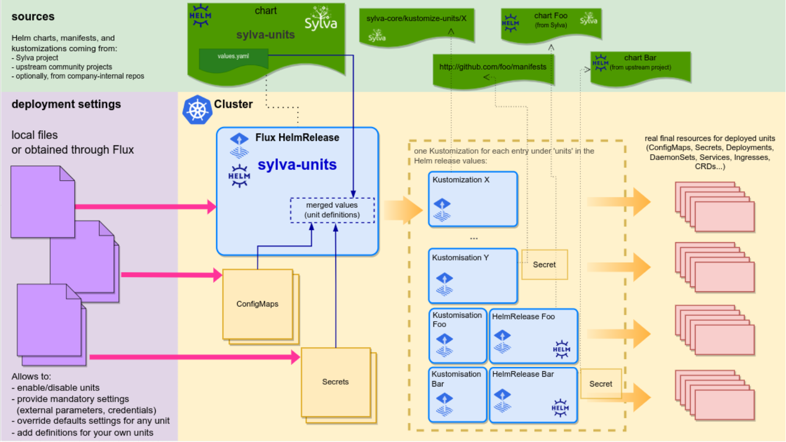

# `sylva-units` Helm chart

## Purpose

The key role of this chart in the Sylva stack is to be the place where we define
how the different pieces of software and configuration elements that make up the Sylva stack
are deployed and configured. We use the term "**unit**" in the context of this chart to
designate those.

In practice a "unit" is typically a software component (such as Cluster API controller,
a Cluster API provider controller, Cert Manager, Vault or Rancher), but it can also
sometimes be just some Kubernetes resources (a ConfigMap, a definition for a custom
resource such as a Cert Manager Issuer, a Kyverno policy, etc).

This Helm chart will define Kubernetes for those "units", thanks to [FluxCD](https://fluxcd.io)
resources, each defining the final resources for a given unit thanks to either on `kustomize` or Helm:

* FluxCD `Kustomizations`, pointing to Git repositories or OCI registries in which [kustomize](https://kustomize.io) `kustomization.yaml` files
  and Kubernetes manifest files are defined describing how to deploy a unit

* FluxCD `HelmReleases`, which contain definitions of Helm releases for Helm charts hosted
  for instance on Git (or in Helm repos) with the desired overridden Helm values.



To ensure that no useless attemps at deploying a unit is made before everything that it
depends on is ready, we declare dependencies between these FluxCD resources,
in their [`spec.dependsOn` field](https://fluxcd.io/flux/components/kustomize/kustomization/#kustomization-dependencies).

This chart also acts as the place where we handle the "meta-release" aspect (i.e. where we
determine the different versions to use for the different pieces of software) and as a single
entry point where the settings of a given Sylva deployment are defined. Indeed, the chart
[`values.yaml`](values.yaml) holds references to the Git and Helm repositories that are used,
the versions used, and the definitions for each "unit" (declaration of dependencies and default settings).

The chart also holds, in the [`values.bootstrap.yaml`](values.bootstrap.yaml) file, the
definition for a specific set of "units" that when deployed on a short-lived deployment cluster
will install Cluster API and its dependency, create the management cluster, redeploy
the sylva-units chart in the management cluster this time with all the desired, and then
ultimately perform a "pivot" operation so that the management cluster is self-supporting
(for this we rely on the ability of Cluster API to move the resources defining a cluster
from one cluster to another, a.k.a `clusterctl move`).

Last, it is important to note that once all those "units" are setup, defined as FluxCD GitOps
reconciliation resources, the full lifecycle of the platform is covered: configuration changes
and software updates will happen by redeploying the `sylva-units` chart with updated values.

All currently maintained units are listed into [`charts/sylva-units/units-description.md`](units-description.md).
This file gathers information about units (description, source, version, etc...).

## Not a typical Helm chart

While most Helm charts create Deployments/ConfigMaps/Service/etc to deploy a given service,
this chart does not do this at all, it instantiates only Flux resources that tell Flux how
to deploy our units.

This Helm chart is also somehow a bit uncommon in that the `values.yaml` file, rather than the
templates themselves, hold most of the data governing the content of the resources produced
by the chart.  This is what allows to fully control what is deployed thanks to overriding
Helm values.

Last, we make heavy use of Helm templating (GoTPL/Sprig) in the `values.yaml` themselves,
which allows a lot of flexibility in the specialization via values override of the target setup.

## Validation

This chart include a JSONSchema, enforced by Helm, to ensure that the values used for
deploying the chart are free of mistakes, typos or inconsistencies and that any such
error can be catched early in the deployment.

## What this chart does

When instantiating this chart on the bootstrap cluster (short-lived single-node, typically built with [kind](https://kind.sigs.k8s.io/)),
this chart will do the following with FluxCD resources:

* install ClusterAPI and the desired providers, and their dependencies (e.g. cert-manager)
  * the units covering this are, for instance: `cert-manager`
* install ClusterAPI definitions for the management cluster
* install Flux on the management cluster
* instantiate itself on the management cluster (step 2 below)

When instantiating this chart on the management cluster, this chart will:

* install Flux resources for the management of Flux CRDs and controllers (to allow managing Flux itself via GitOps)
* install ClusterAPI and the desired providers (and their dependencies)
* Flux definitions for any other unit to deploy on the management cluster (Vault, Rancher, security tools, monitoring tools, etc.)

When a "pivot" setup is wanted (this is the default behavior), where the management cluster
manages its own ClusterAPI lifecycle with GitOps, the following additional actions are done:

* the installation of the chart on the bootstrap cluster triggers a pivot operation once
  ClusterAPI units are installed on the management cluster
* the installation of the chart on the management cluster install Flux resources
  for the ClusterAPI definitions describing itself

## Usage

### Pre-requisite

Flux is already installed on the cluster on which the chart is being installed.

### Manual use of `helm`

This chart would be usable by being directly used _manually_ with the `helm` CLI,
but in the context of Sylva, it will be much convenient to use with the tools provided in
this repo which rely on a FluxCD `HelmRelease` to deploy this chart.

This tooling provide a form of inheritance of "layers" of Helm overrides, to allow
deploying and maintaining different flavors/specialization/parametrizations
of Sylva, relying on `kustomize` overlays carrying the different layers that inject Helm
overrides into a FluxCD `HelmRelease`.

This is how this chart is used in the context of `sylva-core`.

The [`environment-values`](../../environment-values/README.md) directory is the place where all this happens.

## Overriding values

**TBC: This section needs to be completed with information about what values can be overridden
when instantiating this chart**

Additional checks can be added to via the `_internal` variable:

```yaml
_internal:
  checks:
    foo_check: >-
      {{- if and (.Values.cluster.foo | eq "") (not (list "dev" "ci" | has .Values.env_type)) }}
      {{ fail (printf "FOO can not be empty in a production platform") }}
      {{- end }}
```

You can find examples of how the values of this chart are typically overriden for a given deployment
in the `values.yaml` files in sub-directories of [`environment-values`](../../environment-values).

## Controlling which _units_ are enabled on a given run

A few settings are taken into account to determine which _units_ are
enabled for a given release of `sylva-units` Helm chart. They allow to have
flexibility in how the unit definitions can be shared (e.g. between bootstrap cluster
and management cluster) and how the enabled units can be overriden at runtime.

The following criteria determine if a unit _foo_ is enabled :

* all conditions in `units.foo.enabled_conditions` must be verified
* `units.foo.enabled` is true (or `units_enabled_default` if `units.foo.enabled` isn't set)
* _if_ `units_override_enabled` is defined, then:

  * unit `foo` is enabled only if it appears in `units_override_enabled`
  * (`units.foo.enabled` and `units_enabled_default` are ignored)
  * **this is used only to control what units are enabled during bootstrap**

All these are used in the different values files provided by the chart:

* `values.yaml`:

  This file sets `units_enabled_default: false`, and `units.*.enabled` is never set to true.

  As a result, no unit is defined by default.

  Some units have `.enabled` set to false, this is for units which we don't want to enable
  by default, including in the management cluster (see below).

* `management.values.yaml`: uses all units from `values.yaml`

  The management cluster Helm release will layer `values.yaml` plus `management.values.yaml`.

  `management.values.yaml` set `units_enabled_default: true`, so every unit defined in `values.yaml`
  and not explicitly set `enabled: false` gets enabled by default in the management cluster (as long as `enabled_conditions` are met).

* `bootstrap.values.yaml`:

  The management cluster Helm release will layer `values.yaml` plus `bootstrap.values.yaml`.

  `units_override_enabled` is used, so the only units enabled are the ones listed in `units_override_enabled`
  and for which all `enabled_conditions` are met.

* `workload-cluster.yaml`, for workload clusters

  For releases of sylva-units used in workload clusters, the values will layer `values.yaml` plus `workload-cluster.values.yaml`.

  Only the units having `units.xxx.enabled: true` defined in `workload-cluster.yaml` will be enabled
  (those units will be enabled only if enabled_conditions are met).

* values overloaded for a given deployment management cluster:

  Enabling or disabling a unit for the management cluster is doable by defining `units.foo.enabled`
  in the environment values used for the deployment.

## Developing in this chart

As a developer in Sylva, or as a developer in a team using Sylva and wanting to add new "units"
additionally to existing ones, you can define a new "unit" as an entry under `units` in values
(either in `values.yaml` in the chart, or in the values of the Helm release for
a given deployment flavor, or for a given deployment).

### Component using a Kustomization defined in sylva-core repo

```yaml
units:

  my-unit:
    info:
      description: <explain here what the unit is doing>
    repo: sylva-core   # this refers to .source_templates.sylva-core (defined in default values)
    kustomization_spec:
      path: ./kustomize-unit/myComponent
    depends_on:
      my-other-unit: true  # my-unit will not be deployed before my-other-unit is ready
```

### Component using a Kustomization defined in another repository

```yaml
source_templates:
  kind: GitRepository # or OCIRepository
  project-foo:
    spec:
      url: https://gitlab.com/sylva-projects/sylva-elements/foo.git

units:

  my-unit:
    ...
    repo: project-foo
    kustomization_spec:
      path: ./kustomize  # this will point to https://gitlab.com/sylva-projects/sylva-elements/foo.git / kustomize
```

### Component using a Helm chart defined in a Git repository

```yaml
source_templates:
  helm-chart-bar:
    kind: GitRepository
    spec:
      url: https://gitlab.com/sylva-projects/sylva-elements/helm-charts/bar.git
      ref:
        tag: v1.0.3

units:

  my-unit:
    ...
    repo: helm-chart-bar
    helmrelease_spec:
      chart:
        spec:
          chart: ./my-chart   # this will point to https://gitlab.com/sylva-projects/sylva-elements/helm-charts/bar.git / my-chart  on tag v1.0.3
```

With this type of unit definition, Flux will reconciliate the HelmRelease based
on the Git revision (ignoring version field in the Helm chart `Chart.yaml` file).

If the chart is at the root of the Git repository (e.g. `chart: .`), then `helm_chart_artifact_name` has
to be specified:

```yaml
source_templates:
  acme-project-foo:
    ...

units:

  my-unit:
    ...
    repo: acme-project-foo
    helm_chart_artifact_name: foo  # this specifies the Helm chart name used for Helm OCI artifacts
    helmrelease_spec:
      chart:
        spec:
          chart: .   # this will point to https://gitlab.com/sylva-projects/sylva-elements/helm-charts/foo.git / .
```

### Component using a Helm chart defined in a Helm repository

```yaml
units:

  cert-manager:
    ...
    helm_repo_url: https://charts.jetstack.io
    helmrelease_spec:
      chart:
        spec:   # this will use v1.8.2 of the cert-manager chart found in the Helm repo at https://charts.jetstack.io
          chart: cert-manager
          version: v1.8.2
```

### How to feed settings coming from Helm values into the configuration of units

You can use Helm templating to feed settings coming from values into the configuration of your units:

```yaml
mgmt_cluster_domain_name: my-mgmt-cluster.foo.org

units:

  foo:
    ...
    helmrelease_spec:
      ...
      values:
        externalName: "{{ .Values.mgmt_cluster_domain_name }}"

    helm_secret_values: ## this is well suited to secure credentials (what is set here will be stored in a Secret, mapped into the valuesFrom field of the HelmRelease)
      password: '{{ .Values.foo_password }}'

  bar:
    ...
    kustomization_spec:
      ...
      postBuild:
        substitute:
          MAIN_URL: "https://bar-{{ .Values.mgmt_cluster_domain_name }}"

    kustomization_substitute_secrets:  ## this is well suited to secure credentials (what is set here will be stored in a Secret, mapped into the postBuild.substituteFrom field of the Kustomization)
      FOO_PASSWORD: bar

```

As this feature is implemented using the helm templating function (aka "tpl") that only returns strings, you should pass it to the "preserve-type" template if want to prevent the result from being transformed to a string:

```yaml
source_templates:
  sylva-core:
    kind: GitRepository
    spec:
      ...
    auth:
      username: foo
      password: pass

  other-repo:
    spec:
      ...
    auth: '{{ dig "sylva-core" "auth" dict .Values.source_templates | include "preserve-type" }}'  # copy auth from "sylva-core" source, preserving dict type, defaulting to an empty dict
```

There is also a special "set-only-if" template that enable to conditionally add an item to a list or dict:

```yaml

port_list:
- 80
- '{{ tuple 443 .Values.enable_https | include "set-only-if" }}'

units:
  foo:
    # example of a conditional dependency
    depends_on:
      bar: '{{ .Values.cluster.capi_providers.bootstrap_provider | eq "cabpk" }}'
    helmrelease_spec:
      values:
        # set proxy value for foo chart only if proxies value contains an http_proxy key with a non-empty value
        proxy: '{{ tuple .Values.proxies.http_proxy .Values.proxies.http_proxy | include "set-only-if" }}'
        # include 3 as an item in the list only if the bootstrap_provider is cabpk:
        my_list:
          - 1
          - 2
          - '{{ tuple 3 (.Values.cluster.capi_providers.bootstrap_provider | eq "cabpk") | include "set-only-if" }}'
```

It is also possible, with some constraints to refer to values that are themselves templated (aka "nested templating").

```yaml
a: foobar             # this is a plain, non templated, value
b: "{{ .Values.a }}"  # this is a templated value, without "nesting"
c: "{{ .Values.b }}"  # this is a templated value, _with_ "nesting" (ie. b is a template)
```

When doing nested templating, sometimes we want to force interpretation before manipulating the data.
For this to be possible, you **must** use some helpers, as illustrated by the following examples:

* processing a value that should be a _string_ after template evaluation:

  * this **DOES NOT WORK**:

    ```yaml
    a: foobar
    b: "{{ .Values.a }}"
    # WRONG nested templating: it gives the base64 of the '{{ .Values.a }}' string, not the base64 of "foobar"
    d-broken: '{{ .Values.b | b64enc }}'  # WRONG
    ```

  * ... you need to do this instead:

    ```yaml
    a: foobar
    b: "{{ .Values.a }}"
    # working version (gives the base64 of "foobar"):
    d: '{{ tuple . .Values.b | include "interpret-as-string" | b64enc }}'
    ```

* processing a value that should be a _boolean_ after template evaluation:

  * this **DOES NOT WORK**:

    ```yaml
    a: false
    b: "{{ .Values.a }}"
    # WRONG nested templating: it gives the boolean 'not' of the '{{ .Values.a }}' string, which will always evaluate to _false_ (because the string is not empty)
    e-broken: '{{ not .Values.b }}'
    ```

  * ... you need to do this instead:

    ```yaml
    a: false
    b: "{{ .Values.a }}"
    # working version:
    e: '{{ not (tuple . .Values.b | include "interpret-for-test") | include "as-bool" }}'
    ```

  * for the `enabled` and `depends_on.*` fields, the syntax is simplified (the framework calls the helpers for you, when possible):

  ```yaml
  units:
    # ...
    foo-unit:
      # simple case where the value isn't manipulated
      enabled: '{{ .Values.units.bar.enabled }}'  # simple case where the value isn't manipulated
      depends_on:
        # need to use "interpret-for-test" if the value is manipulated, but no need to use 'as-bool'
        x: '{{ not (tuple . .Values.xyz.baz.enabled | include "interpret-for-test") }}'
  ```

* processing a value in a `ternary` statement  ("if <condition> then <result> else <another result>")

  * the `ternary` from Sprig GoTPL library is not usable in some cases, because it badly interacts
    with the behavior of `and` and `or`, which do not always return a boolean, e.g. `and '' true` returns `''`

    * for instance, a statement like `and true '' | ternary "A" "B"` fails

  * this **DOES NOT WORK**:

    ```yaml
    a: true
    b: "{{ not .Values.a }}"
    # WRONG nested templating:
    #   the condition below should be false ("AND(b,a)" is "AND(not a, a)", ie. "AND(false,true)")
    #   but since "(tuple . .Values.b | include 'interpret-for-test')" returns '' (the only way we can return something evaluating as false from a template)
    #   ... and since "and '' true" returns ''
    #   ... then ternary receives an empty string as input, and fails, because it requires a boolean
    e-broken: '{{ (and (tuple . .Values.b | include "interpret-for-test") .Values.a) ) | ternary "condition-is-true" "condition-is-false" }}'
    ```

  * you'll need this instead:

    ```yaml
    a: true
    b: "{{ not .Values.a }}"
    e: '{{ tuple . (and (tuple . .Values.b | include "interpret-for-test") .Values.a) "condition-is-true" "condition-is-false" | include "interpret-ternary" }}'
                   '------------------ condition -----------------------------------' '--value if true--' '--value if false--'
    ```

In order to ease the definition of such templates, you can render locally the interpretation of values using following command:

```shell
helm template interpret charts/sylva-units --show-only templates/extras/interpreted-values.tpl
```

For more details on templating features & limitations, refer to [`_interpret-values.tpl`](templates/_interpret-values.tpl)

### How to add unit information

`info` object adds developer provided data about the unit. At least `description` string is required:

```yaml
units:

  my-unit:
    info:
      description: <explain here what the unit is doing>
      details: <optionally provide some further information about unit>
  ...
```

For external components, `info.maturity` can be added to define what is the state of integration into Sylva stack:

```yaml
units:

  my-unit:
    info:
      description: <explain here what the unit is doing>
      maturity: beta
  ...
```

`info.internal = true` designates an unit which is specific to Sylva used for deployment logic:

```yaml
units:

  my-unit:
    info:
      description: <explain here what the unit is doing>
      internal: true
  ...
```
