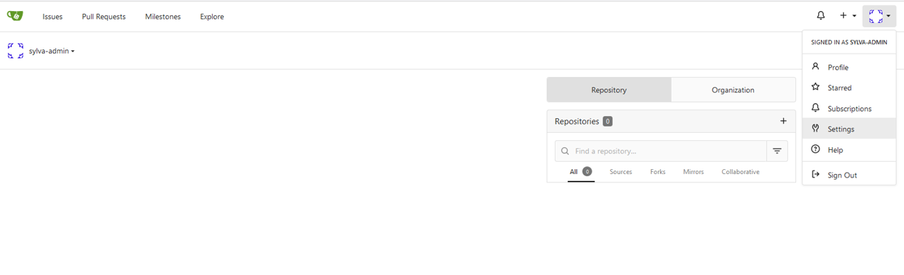

# Gitea in Sylva

## Introduction

Gitea is a self-hosted Git service. Similar to Github, BitBucket and GitLab, it includes Git hosting, code review, team collaboration, CI/CD and package registry.

Links to the upstream official documentation:

- [Documentation](https://docs.gitea.com/)
- [Helm chart](https://gitea.com/gitea/helm-chart)

## Prerequisities

Gitea will be installed in High Availability mode. The management cluster need to have a storage class that provides **ReadWriteMany** accessmode.

Longhorn, for instance, provides ReadWriteMany persistent volumes.

## Installation

In order to install Gitea on a Sylva management cluster, the related units must be enabled in the `sylva-units`'s `values.yaml`.

```yaml
units:
  gitea:
    enabled: true
```

Gitea will be available at the following address : `gitea.<cluster domain>`

## How to use

Please attach a SSH key or create a token in order to authenticate to gitea when using Git cli.

<details>
<summary>How to add an SSH Key</summary>

- Once logged in go to Settings

- Go to SSH/ GPG Keys

- Add key


</details>

<details>
<summary>How to add a token</summary>

- Once logged in go to Settings

- Go to Applications

- Add a token name and make sure to enable "read and write" permission to repository before generating a token


</details>
