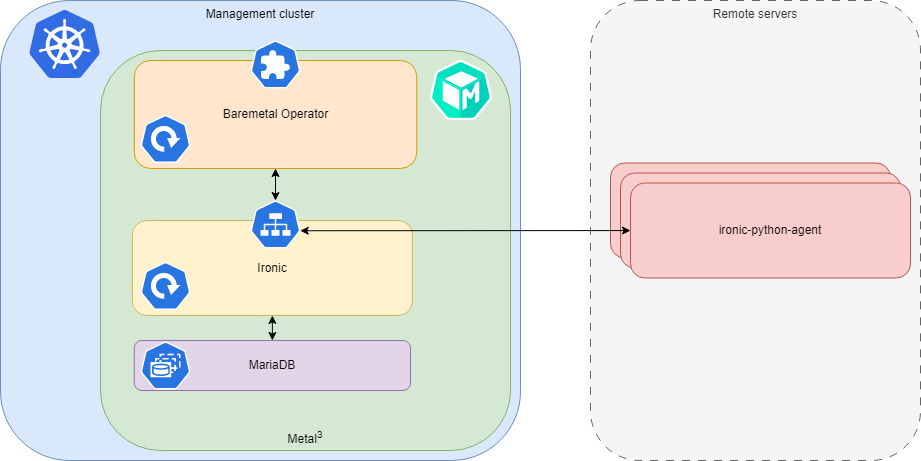
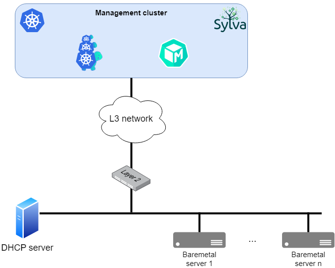
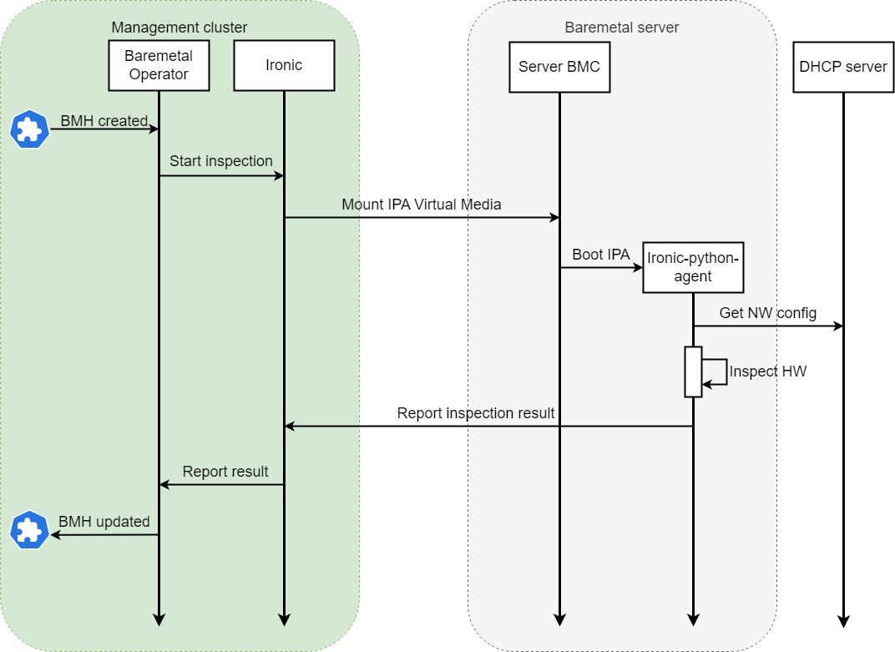
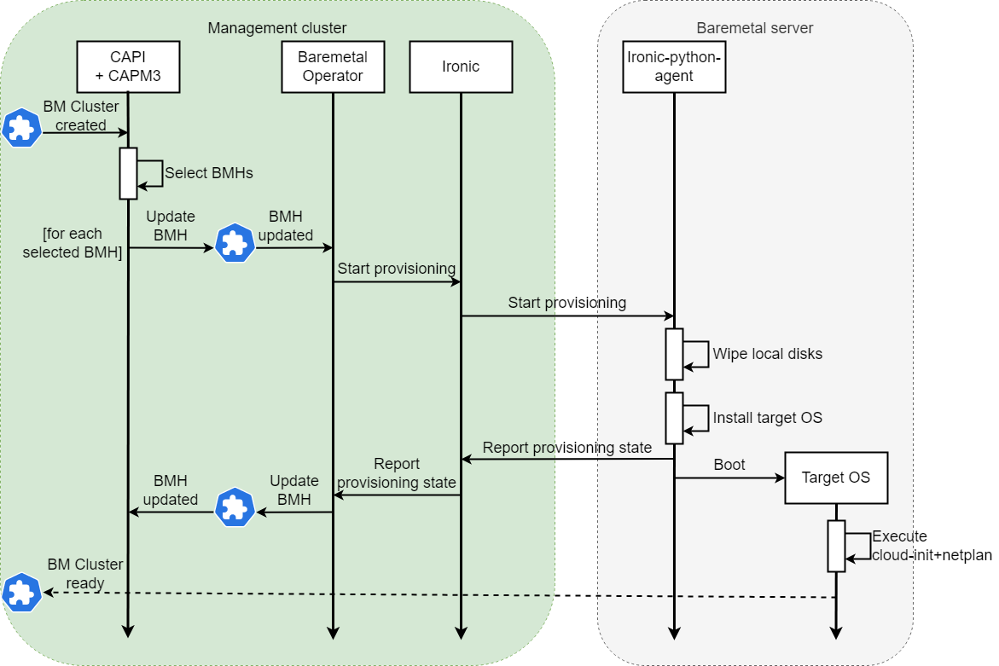

# Metal3 in Sylva

> :warning: The deployment of metal3 proposed in Sylva is currently meant to be used for lab experimentations but not for production

Metal3 is the component of the Sylva stack responsible of the management of baremetal servers.

It provides the capability to enroll, inspect and provision physical servers by means of a set of CRDs.

Metal3 has been integrated with cluster-api through the [Metal3 Cluster API Infrastructure Provider](https://github.com/metal3-io/cluster-api-provider-metal3) so that baremetal servers can be consumed as workload Kubernetes clusters.

This document aims at showing the metal3 architecture and its behavior for the basic operations, then explains how it is meant to be used in the Sylva stack and how can be actually configured as a `sylva-unit` in order to create and manage the lifecycle of distributed baremetal clusters.

If you want to dig deeper take a look at the following links to the official upstream documentation and projects.

Links to the upstream official documentation:

- [Metal3 user guide](https://metal3io.netlify.app/)
- [Metal3 website](http://metal3.io/)
- [Baremetal Operator API](https://github.com/metal3-io/baremetal-operator/blob/main/docs/api.md)
- [Cluster API Provider Metal3 API](https://github.com/metal3-io/cluster-api-provider-metal3/blob/main/docs/api.md)
- [Ironic website](https://ironicbaremetal.org/)
- [Ironic documentation](https://docs.openstack.org/ironic/latest/)
- [Ironic Python Agent documentation](https://docs.openstack.org/ironic-python-agent/latest/)
- [Metal3's IP Address Manager API](https://github.com/metal3-io/ip-address-manager/blob/main/docs/api.md)

Links to the upstream repositories:

- [baremetal-operator](https://github.com/metal3-io/baremetal-operator)
- [cluster-api-provider-metal3](https://github.com/metal3-io/cluster-api-provider-metal3)
- [ironic](https://opendev.org/openstack/ironic)
- [ironic-image](https://github.com/metal3-io/ironic-image) used by metal3
- [Ironic-Python-Agent](https://opendev.org/openstack/ironic-python-agent/)
- [Metal3's IP Address Manager](https://github.com/metal3-io/ip-address-manager)

## Metal3 architecture

The metal3 project aims at reusing the Open Stack component for baremetal management called [Ironic](https://ironicbaremetal.org/) into the Kubernetes ecosystem.

This is achieved by introducing an intermediate layer - the [baremetal-operator](https://github.com/metal3-io/baremetal-operator) - that basically models the domain in CRDs and translates declarative states of the target baremetal infrastructure into instructions to Ironic.



### Baremetal Operator

The baremetal-operator reconciles a set of Custom Resources by interoperating with Ironic.

The most important CRD is the [BareMetalHost](https://github.com/metal3-io/baremetal-operator/blob/main/docs/api.md#baremetalhost): a `BareMetalHost` is the one-to-one representation of a physical server in metal3, it is the object onto which describe the desire state of the server (e.g. powered on/off, provisioned with an OS image and/or a cloud-config volume) and where to look at to know about the state of the machine.

### Ironic

Ironic is a project initially developed to work inside Open Stack but it is deployed as standalone component within metal3.

Ironic is the component that actually interacts with the baremetal servers to be managed while the baremetal-operator is mostly a Kubernetes interface (actually a set of controllers) towords Ironic.

It is capable of interacting with a wide set of vendor's BMC through many protocols such as `IPMI`, `redfish`, `iDRAC`, `iLO` etc. .

Ironic has the responsibility of enrolling baremetal servers, inspecting their hardware, collecting the inspection results into an inventory, provisioning them.

Provision a baremetal server means installing an OS on it starting from scratch and possibly mount a cloud-config drive that can be used by the `cloud-init` tool to configure host specificities and networking.

Ironic inspects and provisions servers by loading on them its agent: the `Ironic-Python-Agent`.

### Ironic-Python-Agent

The [Ironic-Python-Agent](https://docs.openstack.org/ironic-python-agent/latest/) is the agent executed on the baremetal servers used by Ironic to perform operations on the machine.

The reason of the requisite of a DHCP server on one network attached to the servers is due to the need of the Ironic-Python-Agent to get a network configuration since so far it is not supported the usage of a cloud-config drive for it.

The Ironic-Python-Agent collaborates with the Ironic deployment on the management cluster and performs the following operations when required:

1. Hardware inspection
2. Wipe of local disks
3. Download and installation of a target Operating System

So basically when Ironic needs to perform one of the described operations, it first loads on the baremetal machine its agent.

#### Ironic-Python-Agent customization

Sometime you may need to customize the Ironic-Python-Agent image, for example if you need to install on it a specific firmware or driver for your hardware, or if you want to embed in it your CA certificate to secure with TLS the communication between Ironic and the agent.

The way for customizing the Ironic-Python-Agent is using the [Ironic-Python-Agent-builder](https://docs.openstack.org/ironic-python-agent-builder/latest/).

### Metal3 IP Address Manager

Metal3 provides its own mechanism for distributing static IP addresses to the provisioned baremetal machines: the [metal3 IPAM](https://github.com/metal3-io/ip-address-manager).

The metal3 IP address manager works by reconciling a set of [CRDs](https://github.com/metal3-io/ip-address-manager/blob/main/docs/api.md) that represent `IPPools`, `IPAddresses` and `IPClaims`.

In [this blog post](https://metal3.io/blog/2020/07/06/IP_address_manager.html) metal3 maintainers introduce it and explain its behavior.

## Metal3 setup in Sylva

Metal3 has been integrated and configured in the Sylva project in order to be able to use it as a Cluster API Infrastructure Provider (through the [cluster-api-provider-metal3](https://github.com/metal3-io/cluster-api-provider-metal3)) for creating and managing baremetal clusters.

Workload baremetal clusters may be geographically distributed, in general far from the management cluster infrastructure.

From the networking perspective we expect the baremetal servers to be connected to some IP subnets different from the ones the management cluster is attached to but this is not a requirement for the metal3 deployment.

Relying on PXE for booting the servers in such scenario would be complex because it would need the configuration of DHCP relays local to the machines to manage.

Given the additional network configuration required for PXE setups the proposed metal3 deployment is based on the usage of `Virtual Media`.

We provide a pre-configured setup of metal3 for the Sylva project in order to have it ready to use as soon as possible without having to deal with its complex configuration.



The figure above shows the architecture of metal3 in Sylva with a focus on the networking: note that the "remote" baremetal servers have a DHCP server on their local network, this is a requirement we will explain better later on in this doc.

> The figure above shows n baremetal servers all connected to the same L2 network: this is not mandatory, metal3 can manage machines in n different locations connected to different IP networks, the figure shows only one just for simplicity.

## How it works

This section of the docs describes the workflow of the basic operation performed with metal3 (baremetal server enrollment and provisioning) with the objective of providing awareness about the many components involved, their interactions and how are distributed.

Understanding the workflows is very important for debugging metal3.

### Baremetal server registration and inspection workflow



When a BareMetalHost is created on the management cluster and includes the server BMC URL and credentials, the registration and inspection operations begin.

Ironic is requested to start the hardware inspection of the baremetal machine by the baremetal-operator and reacts by mounting the Ironic-Python-Agent to the server as a Virtual Media and requesting the BMC to boot it.

After the server reboot, the Ironic-Python-Agent starts looking for a network configuration: it enables all the available network interfaces and for each runs the DHCP client.

When the network configuration has been received, the agent runs a process to introspect all the hardware available and then reports the information discovered to Ironic on the management cluster.

Finally the baremetal-operator gets from Ironic the inspection results and updates the status of the BareMetalHost.

### Cluster API baremetal cluster provisioning workflow


When the CRDs representing a cluster on metal3 infrastructure are created on the management cluster, the process of baremetal cluster provisioning begins.

The cluster-api (CAPI) and cluster-api-provider-metal3 (CAPM3) controllers start reconcyling the created objects: in particular CAPM3 manages the set of resources of the kind Metal3\<CAPI resource name\> (e.g. Metal3Cluster, Metal3Machine, Metal3MachineDeployment and so on).


Basically there are some CRDs describing the cluster topology: `KubeADMControlPlane` defines the number of control plane nodes while `MachineDeployment` defines the number of worker nodes.

Each kind of node (control plane and worker) is associated to a `Metal3MachineTemplate` which in turn contains in its `spec` the field `hostSelector`.
The `hostSelector` defines a criteria for matchine labels on `BareMetalHost` objects so it is the way to decide what servers to consume for the cluster as control plane or worker nodes.

So the CAPM3 controller processes the `hostSelector` spec, selects the `BareMetalHosts` to be consumed and updates their spec with an OS `image`, `userData` and `networkData` so that metal3 can start the provisioning process for each of them.

Ironic gets requested from the baremetal-operator to provision servers and reacts by loading the `Ironic-Python-Agent` on them if needed (it may be still ready because of a previous inspection) and requesting the OS provisioning by providing the URL of the target image.

The Ironic-Python-Agent downloads such image, wipes all the local disks, configures the raid setup if requested and installs the target OS on one local disk along with the `cloud-config` drive provided.

When the installation is finished the `Ironic-Python-Agent` reports the success to Ironic and reboots the server.

After the reboot the server will boot the just installed target OS and will execute the `cloud-init` that will setup host specific configuration (such as users and network) and will execute the `kubeadm init/join` command to turn itself into a Kubernetes cluster node.

In the meanwhile the state of the `BareMetalHost` will be updated so that it will result as `provisioned`.

## Metal3 deployment in Sylva

Metal3 can be deployed as a `unit` in the Sylva stack by enabling the units `metal3` and `capm3` in the `sylva-units` helm chart.

### Helm chart

We provide an helm chart to simplify the installation and configuration of Metal3 in the scenario of interest of the Sylva stack, that is with level 3 connectivity between Metal3 on the management cluster and the remote baremetal machine to be managed and consumed by cluster-api.
[Here](https://gitlab.com/sylva-projects/sylva-elements/helm-charts/metal3) you can find the Metal3 helm chart with its documentation.

### How to enable and configure metal3 in Sylva

In order to install metal3 and CAPM3 on a Sylva management cluster, the related units must be enabled in the `sylva-units`'s `values.yaml`.

```yaml
units:
  #[...]
  capm3:
    enabled: yes
  # (metal3 unit is automatically enabled when "capm3" is enabled)
  #[...]
```

The `capm3` unit doesn't require any configuration, it simply acts as an intermediate layer between CAPI and Metal3, so in addition to configure metal3 enabling `capm3` is enough to enable bare metal3 cluster management with CAPI.

The `metal3` unit configuration can be provided through the [metal3 helm chart](https://gitlab.com/sylva-projects/sylva-elements/helm-charts/metal3/-/tree/main/sylva/metal3) `values.yaml` to be included in the field `units.metal3.helmrelease_spec.values`.  

By default the `metal3` unit deploys Ironic service and automatically configures it. However you may have to need to customize ironic IP if management cluster IP is not directly accessible from workload clusters.  

### Networking requirements

### Provisioning with Virtual Media

Telcos envision a scenario in which clusters will be very distributed geographically and, at least at the far edge, will be Kubernetes cluster on baremetal.

In such scenario metal3 and the remote servers may be interconnected through a common broadcast domain or not.

Relying on PXE to remotely boot servers may involve the configuration of DHCP relays which increases the complexity of the setup.

Instead the alternative `Virtual Media` is able to work in both cases (L2 or L3 connectivity) with much less complexity.

Hence the Sylva project proposes a customized configuration of the metal3 deployment able to deploy the [`ironic-python-agent`](https://github.com/openstack/ironic-python-agent) on servers by mounting a `Virtual Media` through the BMCs for the machines management.

The Ironic-Python-Agent is driven by Ironic and needs to communicate with it: for the purpose three Ironic ports are exposed through a `LoadBalancer Service`.

The configuration has a **requirement**: in order for the remote servers to be able to reach the Ironic Service on the management cluster, a **DHCP server** must be configured locally to their location (or alternatively a DHCP Relay).

### Images for target OS

In order for the baremetal servers to be consumed by cluster-api and used as workload cluster nodes, the Operating System to be installed on them must include the Kubelet of the Kubernetes version to be used and cloud-init for the host specific customizations.

Such image can be in raw or qcow2 format.

We rely on tooling in [Sylva diskimage-builder](https://gitlab.com/sylva-projects/sylva-elements/diskimage-builder) to build OS images for metal3 in Sylva.

## Known issues

In case of troubles it may be useful to take a look at the Ironic's [known issues](https://docs.openstack.org/ironic/latest/admin/drivers/idrac.html#known-issues).

In case you get this error

```
No disk space left on device:
```

try to increase the size of Ironic PVC through the value `persistence.ironic.size` of the metal3 helm chart.

Take into account that Ironic builds an ISO for each server to manage, so you can estimate the right size roughly with this formula:

```
ironic_pvc_size = <Ironic-Python-Agent ramdisk size> * <number of bm servers to manage>
```

## Troubleshooting

In case of issues there may be a wide range of reasons.

In order to debug and get some more information you should find useful the following commands to retrieve the logs of the many components involved:

```bash
# baremetal-operator controller manager
kubectl logs deployments/baremetal-operator-controller-manager -n metal3-system -c manager

# ironic api and conductor
kubectl logs deployments/ironic -n metal3-system -c ironic

# ironic inspector
kubectl logs deployments/ironic -n metal3-system -c ironic-inspector

# ironic HTTP server
kubectl logs deployments/ironic -n metal3-system -c ironic-httpd

# CAPM3 controller manager
kubectl logs deployments/capm3-controller-manager -n capm3-system

# Metal3 IPAM controller manager
kubectl logs deployments/ipam-controller-manager -n capm3-system
```
